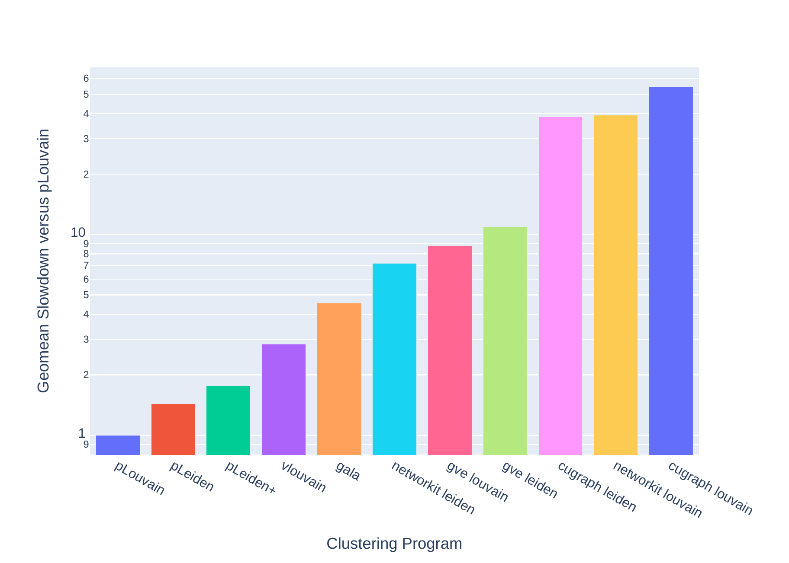
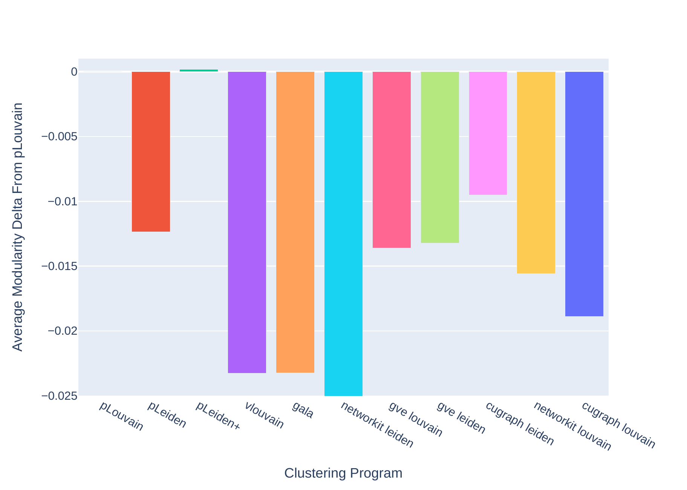
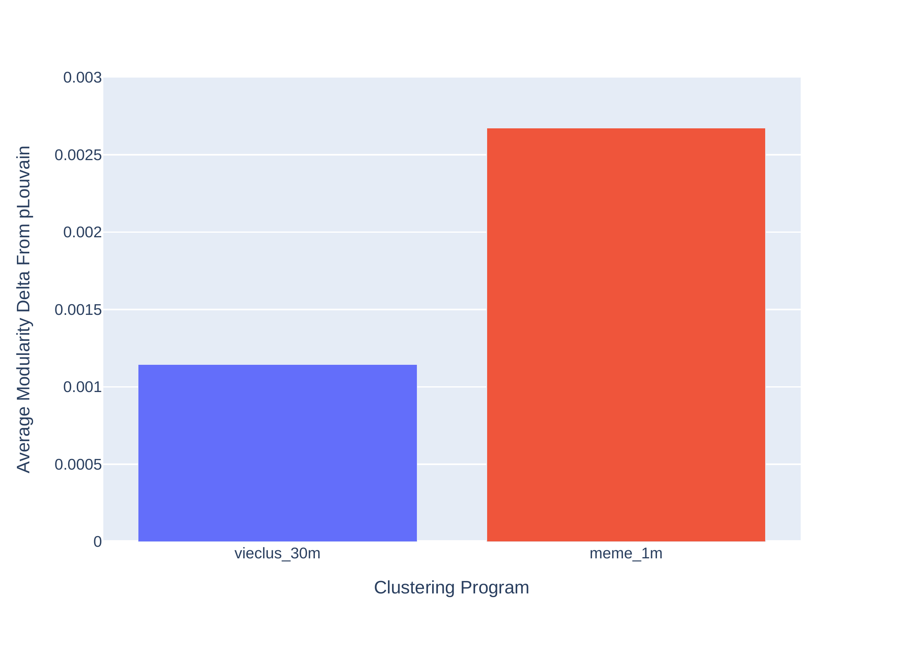

# Graph Clustering Algorithms for the GPU

Depends on Kokkos (https://github.com/kokkos/kokkos) (version >= 4.7.0 recommended), KokkosKernels (https://github.com/kokkos/kokkos-kernels) (version >= 4.7.0 recommended), and the Cuda Toolkit (version >12.0).

This is a parallel undirected graph clustering package that implements novel GPU-first formulations of the Louvain and Leiden clustering algorithms.  
Our pLeiden and pLeiden+ implementations are the first to provide the Leiden algorithm's six original guarantees in a parallel setting.

## Usage

### Executables

#### Clustering Programs
**pLouvain**: Run the Louvain+ algorithm. Choose this one for fast, high-quality clustering.  
**pLeiden**: Run the Leiden algorithm. Choose this one for intra-cluster connectivity guarantees, but lower quality than pLouvain or pLeiden+.  
**pLeiden+**: Run the Leiden+ algorithm. Use this one with multiple iterations for highest-quality. Intra-cluster connectivity guarantees are delayed until algorithm encounters a stable iteration.  

#### Evolutionary/Memetic Clustering
**meme**: Uses a memetic clustering algorithm inspired by VieClus (https://github.com/VieClus/VieClus).  
Initial clustering pool is generated with pLeiden+.  
Recombination is performed by pLouvain.  
Mutation operator is performed with 5 iterations of pLeiden+.  
Mutation operator is performed on the output of the recombination operator.  
Quality is generally superior to VieClus in the same amount of time.

#### Helpers
**verify_obj**: Takes a graph file and a clustering file as defined above as input. Computes the modularity of the given clustering on the given graph.

## Parameters
### Required For All
**-i \<Graph File\>**: A graph represented in the Metis file format or the Matrix Market file format. Files ending in `".mtx"` will be interpreted as Matrix Market files, all other file extensions will be interpreted as Metis files.
### Required for verify_obj
**-clusters \<Cluster Input File\>**: A file containing a clustering of the graph, numbered `0` to `c-1` for `c` clusters. Line `x` gives the cluster to which vertex `x` belongs.
### Optional For All
**-objective \<Objective Name\>**: Specify the objective which will be optimized/calculated. See Objectives.md for more detail. Default: Mod (Modularity)  
**-lambda \<Double or float\>**: Specify the lambda modifier for the objective. See Objectives.md for more detail. Default: 1.0  
**-vtx_weights \<Vertex Weights File\>**: Specify custom vertex weights for the objective. See Objectives.md for more detail. Default: Depends on objective. Can't be used with certain objectives.
### Optional For pLouvain, pLeiden, pLeiden+, and meme
**-o \<Output Clusters File\>** Writes the clustering, numbered `0` to `c-1` for `c` clusters, to the given file. Line `x` gives the cluster to which vertex `x` belongs. Default: None
### Optional for pLouvain, pLeiden, and pLeiden+
**-ex_iters \<Integer\>**: Applies the program successively on its own output for the given iteration count. Default: 0  
**-trials \<Integer\>**: Performs this number of clustering trials, and returns the best clustering. Default: 1  
**-metrics \<Output Metrics File\>**: Dump various timing data in json format to file. Default: None
### Optional for meme
**-pop_size \<Integer\>**: Population size of evolutionary method. Default: 10. Minimum: 10  
**-time_limit \<Integer\>**: Time limit of evolutionary method in seconds. Default: 10. Minimum: 10

### Input Format
Our parser fails if it finds vertex weights within metis graph files. Please specify vertex weights with **-vtx_weights** parameter.  
Metis format importing is faster than Matrix Market format importing.

## Comparison versus State of the Art Parallel Clustering Algorithms
The below images compare our programs with the following state-of-the-art competitors:  
v-Louvain: https://github.com/puzzlef/louvain-communities-cuda  
GALA: https://github.com/LinXi-lx/GALA  
GVE-Louvain: https://github.com/puzzlef/louvain-communities-openmp  
GVE-Leiden: https://github.com/puzzlef/leiden-communities-openmp  
Networkit Louvain: https://networkit.github.io/  
Networkit Leiden: https://networkit.github.io/  
Cugraph Louvain: https://github.com/rapidsai/cugraph  
Cugraph Leiden: https://github.com/rapidsai/cugraph

GPU programs (pLouvain, pLeiden, pLeiden+, v-Louvain, GALA, cugraph Louvain/Leiden) are run on an Nvidia B200 GPU.  
CPU programs (GVE-Louvain/Leiden, Networkit Louvain/Leiden) are run on an AMD Ryzen 9950x3D CPU.

Tests are ran on a set of 57 large graphs commonly used for comparison of graph clustering and partitioning methods.  
https://scholarsphere.psu.edu/resources/cc9dcf42-f5eb-42f1-80ec-5d50a402fc22

### Runtime Comparison

pLouvain is up to 1200x faster than Cugraph Louvain for some graphs.

### Modularity Comparison

Networkit Leiden is off the chart at -0.415.  
pLouvain and pLeiden+ achieve higher quality than each state-of-the-art competitor nearly universally.

### Memetic Modularity Comparison

Our memetic clustering algorithm is run for 1 minute on a B200 GPU, with a population size of 100.  
VieClus is run on an AMD Epyc 9655 CPU with a time limit of 30 minutes, and 16-24 processes depending on memory usage.  
As each VieClus process independently runs a Louvain-like clustering algorithm (among other tasks), the available system memory severely constrains the number of processes that may be used.  
Other VieClus settings are left as default.  
Our memetic algorithm can produce better modularity-valued clusterings on several dimacs10 challenge graphs in 10 minutes than VieClus can in 16 hours.

## Possible Features
Python wrapper.  
C++ library.

If you are interested in these potential features or have any requests, please open an issue to let us know.